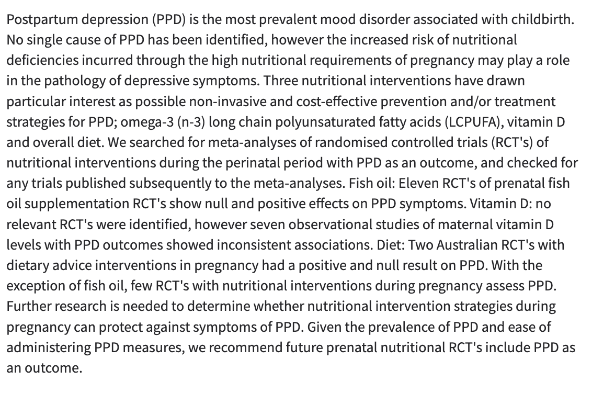
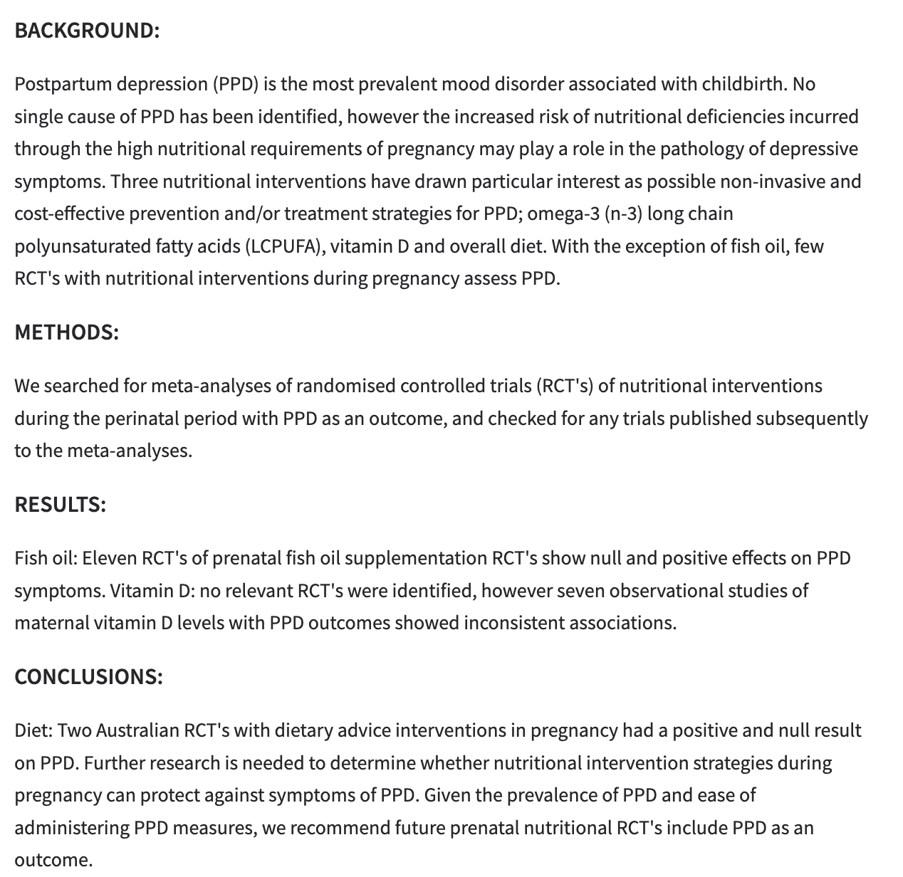
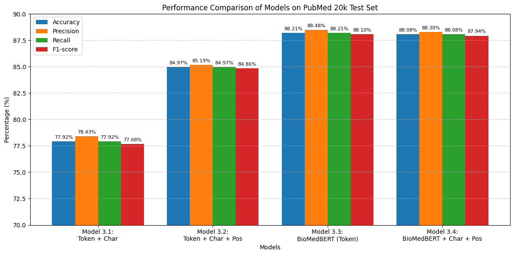

# PubMed RCT Sentence Classification Project

This project implements multiple deep learning models for biomedical sentence classification using the PubMed RCT dataset. The models include a Dual-Input Hybrid model, Token-BERT, Tribrid USE, and Tribrid BioBERT.

## Project Structure

```
project_root/
│
├── src/
│   ├── data.py           # Data loading and preprocessing
│   ├── models/
│   │   ├── __init__.py
│   │   ├── dual_input_hybrid.py
│   │   ├── token_bert.py
│   │   ├── tribrid_use.py
│   │   └── tribrid_biobert.py
│   ├── train.py          # Training logic
│   ├── evaluate.py       # Evaluation and comparison
│   └── utils.py          # Helper functions
│
├── main.py               # Entry point for running experiments
├── requirements.txt      # Dependencies
└── README.md
```

## Models

1. **Dual-Input Hybrid Model**
   - Combines character-level and token-level features
   - Uses Universal Sentence Encoder for token-level processing
   - Includes character-level BiLSTM for morphological features
   - Good for handling out-of-vocabulary words

2. **Token-BERT Model**
   - Uses standard BERT for text encoding
   - Pre-trained on general English text
   - Good for general language understanding

3. **Tribrid USE Model**
   - Uses Universal Sentence Encoder
   - Optimized for sentence-level tasks
   - Efficient for transfer learning

4. **Tribrid BioBERT Model**
   - Uses BioBERT, specialized for biomedical text
   - Pre-trained on PubMed and PMC articles
   - Best suited for medical/scientific text

## Visualizations

### Model Architecture and Data Flow


*Figure 1: Model input processing pipeline showing how raw text is transformed into model inputs. The diagram illustrates the preprocessing steps including text tokenization, character-level splitting, and embedding generation for both token and character inputs.*


*Figure 2: Model output structure showing the classification pipeline and output format. The diagram demonstrates how different model architectures (Dual-Input Hybrid, Token-BERT, Tribrid USE, and Tribrid BioBERT) process the inputs and generate classification outputs.*

### Model Performance Comparison


*Figure 3: Performance comparison of different models on the PubMed RCT dataset. The benchmark results show the relative performance of each model architecture in terms of accuracy, precision, recall, and F1-score across different classes.*

### Key Insights from Visualizations

1. **Input Processing (Figure 1)**
   - Shows the dual-path processing of text data
   - Illustrates how character-level and token-level features are extracted
   - Demonstrates the preprocessing pipeline for different model architectures

2. **Output Structure (Figure 2)**
   - Displays the classification pipeline for each model type
   - Shows how different architectures combine features
   - Illustrates the final classification layer structure

3. **Performance Metrics (Figure 3)**
   - Provides a comprehensive comparison of model performance
   - Shows the strengths and weaknesses of each architecture
   - Helps in selecting the most suitable model for specific use cases

## Installation

1. **Clone the repository:**
   ```bash
   git clone <repository-url>
   cd <repository-name>
   ```

2. **Install dependencies:**
   ```bash
   pip install -r requirements.txt
   ```

3. **Prepare the PubMed RCT dataset:**
   Download and extract the dataset so you have a directory containing `train.txt`, `dev.txt`, and `test.txt`.

## Usage

### Training

Train a single model:
```bash
python main.py --mode train --model <model_name> --data_dir /path/to/data --epochs 5 --batch_size 32
```

Train all models:
```bash
python main.py --mode train --model all --data_dir /path/to/data --epochs 5 --batch_size 32
```

### Evaluation

Evaluate a single model:
```bash
python main.py --mode evaluate --model <model_name> --data_dir /path/to/data
```

Evaluate all models:
```bash
python main.py --mode evaluate --model all --data_dir /path/to/data
```

### Training and Evaluation

Train and evaluate a single model:
```bash
python main.py --mode train_and_evaluate --model <model_name> --data_dir /path/to/data
```

Train and evaluate all models:
```bash
python main.py --mode train_and_evaluate --model all --data_dir /path/to/data
```

### Command Line Arguments

- `--mode`: Choose from ['train', 'evaluate', 'train_and_evaluate']
- `--model`: Choose from ['dual_input_hybrid', 'token_bert', 'tribrid_use', 'tribrid_biobert', 'all']
- `--data_dir`: Path to PubMed RCT data directory
- `--epochs`: Number of training epochs (default: 5)
- `--batch_size`: Batch size (default: 32)
- `--checkpoint_path`: Path to save/load model weights (default: 'best_weights/checkpoint.ckpt')
- `--output_dir`: Directory to save results (default: 'results')

## Output Structure

```
results/
├── model_name/
│   ├── metrics.txt           # Detailed classification metrics
│   ├── confusion_matrix.png  # Confusion matrix visualization
│   ├── training_history.png  # Training/validation curves
│   └── logs/                 # TensorBoard logs
└── model_comparison.txt      # Comparison of all models
```

## Features

- **Training Features:**
  - Early stopping with best weights restoration
  - Learning rate reduction on plateau
  - Model checkpointing
  - TensorBoard integration
  - Label smoothing
  - Data prefetching and batching

- **Evaluation Features:**
  - Classification metrics (precision, recall, F1-score)
  - Confusion matrix visualization
  - Training history plots
  - Model comparison functionality
  - Detailed metrics reporting

## Dependencies

- TensorFlow 2.15.0
- TensorFlow Hub 0.15.0
- TensorFlow Text 2.15.0
- Pandas
- NumPy
- scikit-learn
- Matplotlib
- Seaborn

## Contributing

Feel free to submit issues and enhancement requests!